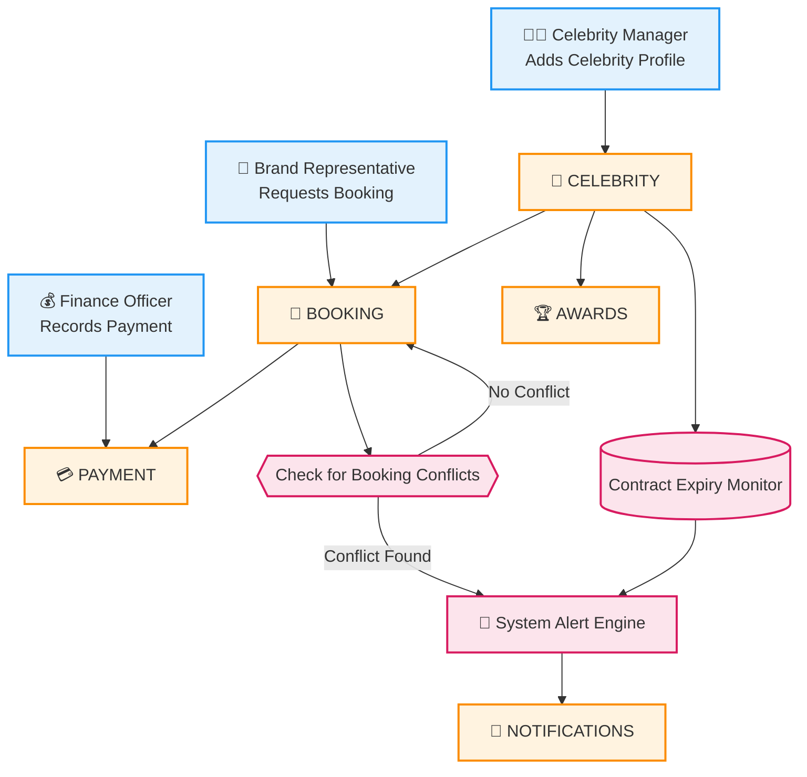
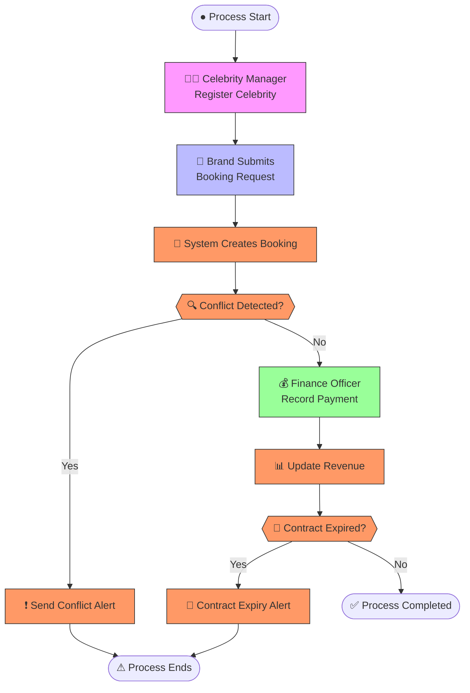

# 🌙 MOONLIGHT AGENCY — PL/SQL FINAL EXAM

## 👤 Identification
- **Name:** Uwumuremyi Honorine  
- **Student ID:** 27830  
- **Project Title:** Moonlight Talent Management System  
- **Course:** INSY 8311 — Database Development with PL/SQL  
- **Academic Year:** 2025–2026  
- **Lecturer:** Eric Maniraguha (eric.maniraguha@auca.ac.rw)  

---

# 🚀 PHASE I: Problem Statement & Presentation

## 📌 Objective
To identify a real-world talent management problem requiring a **PL/SQL-based Oracle database system** capable of handling bookings, payments, awards, contract tracking, and automated alerts.

---

## 💡 Project Summary: Moonlight Agency Management System

### 📖 Problem Definition
Talent and entertainment agencies manage multiple celebrities with different schedules, fees, availability, and events.  
Manual operations lead to:

- Frequent scheduling conflicts / double-booking  
- Untracked or missed payments  
- No insight into revenue per celebrity or per brand  
- Difficulty monitoring contract deadlines  
- Poor tracking of awards and achievements  
- Lack of automated alerts  

### 🌍 Context
The system will serve:

- Entertainment and talent agencies  
- Celebrity managers  
- Booking and brand coordinators  
- Finance officers  

### 🎯 Target Users
- Celebrity Manager  
- Brand Representative  
- Finance Officer  
- Administrative Staff  

### 🏆 Project Goals
- 🧑‍🎤 Centralize all celebrity profiles  
- 📅 Automate booking management with conflict detection  
- 💰 Track payments and revenue  
- 🏆 Manage awards and achievements  
- ⚠ Generate alerts (conflicts, unpaid fees, contract expiry)  
- 📊 Enable MIS analytics and insights  

---

## 🧩 Key Database Entities

| Entity | Attributes |
|--------|------------|
| **CELEBRITY** | celebrity_id (PK), full_name, category, management_fee, contract_start_date, contract_end_date, contact_details |
| **BRAND** | brand_id (PK), brand_name, company_type, email, phone |
| **BOOKING** | booking_id (PK), celebrity_id (FK), brand_id (FK), event_date, event_type, event_location, booking_fee, status |
| **PAYMENT** | payment_id (PK), booking_id (FK), payment_date, amount_paid, payment_status |
| **AWARDS** | award_id (PK), celebrity_id (FK), award_name, award_year |
| **NOTIFICATIONS** | notification_id (PK), message |

### 🔗 Relationships
- One **Celebrity** → Many **Bookings**  
- One **Brand** → Many **Bookings**  
- One **Booking** → Many **Payments**  
- One **Celebrity** → Many **Awards**  

---

## 💎 System Benefits
- Prevents double-booking  
- Tracks revenue and financial flows  
- Automates alert generation  
- Improves contract management  
- Enhances decision-making with analytics  

---

# 🧭 Phase II UML/BPMN Diagram

## 🔍 Scope & Purpose
This phase models the **talent management workflow** of the Moonlight Agency system, covering how celebrities are registered, how bookings are created, how payments are recorded, and how automated alerts support the decision-making process.  
The MIS ensures smoother agency operations by reducing manual errors, improving schedule accuracy, and enabling real-time financial and contract monitoring.

---

## 👥 Key Actors

| Role                 | Responsibility |
|----------------------|----------------|
| **Celebrity Manager**    | Registers celebrities, updates contract details, reviews alerts |
| **Brand Representative** | Submits booking requests for events |
| **Finance Officer**      | Records booking payments and updates revenue |
| **Booking System**       | Creates and validates bookings, checks for conflicts |
| **Alert Engine**         | Sends alerts for conflicts, expirations, and unpaid bookings |

---

## 🖼️ Process Diagram

### ✅ Tools Used:
- **Mermaid** (Lightweight Markdown diagramming)  
- **Draw.io** (Standard BPMN modeling)

---

### 🔗 Mermaid Diagram  

---

### 🧩 Draw.io BPMN Diagram  

---

## 🧠 MIS Value & Flow Summary
The process begins with the **Celebrity Manager** registering a new celebrity. When a **Brand Representative** submits a booking request, the **Booking System** evaluates the request and checks for scheduling conflicts.

If a **conflict is detected**, the **Alert Engine** notifies the manager.  
If **no conflict** exists, the **Finance Officer** records the payment, and the system updates the revenue details.

Next, the system checks if a celebrity’s **contract is expired or close to expiring**. If so, the **Alert Engine** sends a contract-expiry alert automatically.

This MIS workflow supports the agency by:
- Enabling **real-time decision-making**
- Improving **operational efficiency**
- Reducing **manual scheduling errors**
- Ensuring **accurate financial tracking**
- Maintaining **up-to-date contract records**

---

## 💻 Mermaid Code Reference

# 🧩 Phase III: Logical Model Design

## 🎯 Objective
The Moonlight Agency PL/SQL system manages celebrities, bookings, brands, payments, awards, and automated notifications.  
This phase focuses on converting these real-world requirements into a **fully normalized (3NF)** logical database model with correct primary keys, foreign keys, and constraints.

The goal is to design a relational structure that ensures:
- Accurate tracking of bookings and payments  
- Reliable conflict detection  
- Centralized celebrity and brand information  
- Automated alert generation  
- Clean, normalized, scalable data management  

---

## 🗃️ Entities & Attributes

### 🧑‍🎤 CELEBRITY
| Attribute              | Type          | Constraint                                   |
|------------------------|---------------|-----------------------------------------------|
| celebrity_id           | NUMBER        | Primary Key (Auto-generated)                 |
| full_name              | VARCHAR2(150) | NOT NULL                                     |
| category               | VARCHAR2(100) | NOT NULL                                     |
| management_fee         | NUMBER(10,2)  | CHECK (management_fee > 0)                   |
| contract_start_date    | DATE          | NOT NULL                                     |
| contract_end_date      | DATE          | NOT NULL                                     |
| contact_details        | VARCHAR2(200) | NOT NULL                                     |

---

### 🏢 BRAND
| Attribute     | Type          | Constraint                       |
|---------------|---------------|----------------------------------|
| brand_id      | NUMBER        | Primary Key (Auto-generated)     |
| brand_name    | VARCHAR2(120) | NOT NULL                         |
| company_type  | VARCHAR2(100) | NOT NULL                         |
| email         | VARCHAR2(150) | UNIQUE, NOT NULL                 |
| phone         | VARCHAR2(20)  | NOT NULL                         |

---

### 📄 BOOKING
| Attribute       | Type          | Constraint                                          |
|------------------|--------------|------------------------------------------------------|
| booking_id       | NUMBER       | Primary Key (Auto-generated)                        |
| celebrity_id     | NUMBER       | Foreign Key → CELEBRITY                             |
| brand_id         | NUMBER       | Foreign Key → BRAND                                 |
| event_date       | DATE         | NOT NULL                                            |
| event_type       | VARCHAR2(100)| NOT NULL                                            |
| event_location   | VARCHAR2(150)| NOT NULL                                            |
| booking_fee      | NUMBER(10,2) | CHECK (booking_fee > 0)                             |
| status           | VARCHAR2(50) | CHECK (status IN ('Pending','Confirmed','Cancelled')) |

---

### 💰 PAYMENT
| Attribute      | Type            | Constraint                                  |
|----------------|-----------------|-----------------------------------------------|
| payment_id     | NUMBER          | Primary Key (Auto-generated)                |
| booking_id     | NUMBER          | Foreign Key → BOOKING                       |
| payment_date   | DATE            | DEFAULT SYSDATE                             |
| amount_paid    | NUMBER(10,2)    | CHECK (amount_paid >= 0)                    |
| payment_status | VARCHAR2(50)    | CHECK (payment_status IN ('Paid','Pending'))|

---

### 🏆 AWARDS
| Attribute       | Type          | Constraint                      |
|------------------|--------------|----------------------------------|
| award_id         | NUMBER       | Primary Key (Auto-generated)    |
| celebrity_id     | NUMBER       | Foreign Key → CELEBRITY         |
| award_name       | VARCHAR2(120)| NOT NULL                        |
| award_year       | NUMBER(4)    | CHECK (award_year >= 1900)      |

---

### 🔔 NOTIFICATIONS
| Attribute        | Type          | Constraint                       |
|------------------|---------------|-----------------------------------|
| notification_id  | NUMBER        | Primary Key (Auto-generated)      |
| message          | VARCHAR2(255) | NOT NULL                          |
| created_at       | DATE          | DEFAULT SYSDATE                   |

---

## 🔄 Relationships & Constraints
- **CELEBRITY → BOOKING** → 1:N  
- **BRAND → BOOKING** → 1:N  
- **BOOKING → PAYMENT** → 1:N  
- **CELEBRITY → AWARDS** → 1:N  
- **BOOKING → NOTIFICATIONS (indirect)**  
- Foreign keys enforce referential integrity  
- CHECK constraints ensure valid business rules  
- UNIQUE emails avoid duplication  

---

## 📐 Normalization (3NF Verified)

- ✅ **1NF:** All attributes have atomic values  
- ✅ **2NF:** No partial dependencies (all non-PK attributes depend on full PK)  
- ✅ **3NF:** No transitive dependencies (non-PK attributes depend only on PK)  
- Ensures clean, consistent, and scalable data  

---

## 🖼️ ERD Diagram

> 🟦 **Visual Placeholder: Logical Model ERD**  
> 👉 *This is where your Moonlight Agency ERD images appear.*

### ERD Part 1  

---

### ERD Part 2  

---

# ✅ End of Phase III
