# 🌙 MOONLIGHT AGENCY — PL/SQL FINAL EXAM

## 👤 Identification
- **Name:** Uwumuremyi Honorine  
- **Student ID:** 27830  
- **Project Title:** Moonlight Talent Management System  
- **Course:** INSY 8311 — Database Development with PL/SQL  
- **Academic Year:** 2025–2026  
- **Lecturer:** Eric Maniraguha (eric.maniraguha@auca.ac.rw)  

---

# 🚀 PHASE I: Problem Statement & Presentation

## 📌 Objective
To identify a real-world talent management problem requiring a **PL/SQL-based Oracle database system** capable of handling bookings, payments, awards, contract tracking, and automated alerts.

---

## 💡 Project Summary: Moonlight Agency Management System

### 📖 Problem Definition
Talent and entertainment agencies manage multiple celebrities with different schedules, fees, availability, and events.  
Manual operations lead to:

- Frequent scheduling conflicts / double-booking  
- Untracked or missed payments  
- No insight into revenue per celebrity or per brand  
- Difficulty monitoring contract deadlines  
- Poor tracking of awards and achievements  
- Lack of automated alerts  

### 🌍 Context
The system will serve:

- Entertainment and talent agencies  
- Celebrity managers  
- Booking and brand coordinators  
- Finance officers  

### 🎯 Target Users
- Celebrity Manager  
- Brand Representative  
- Finance Officer  
- Administrative Staff  

### 🏆 Project Goals
- 🧑‍🎤 Centralize all celebrity profiles  
- 📅 Automate booking management with conflict detection  
- 💰 Track payments and revenue  
- 🏆 Manage awards and achievements  
- ⚠ Generate alerts (conflicts, unpaid fees, contract expiry)  
- 📊 Enable MIS analytics and insights  

---

## 🧩 Key Database Entities

| Entity | Attributes |
|--------|------------|
| **CELEBRITY** | celebrity_id (PK), full_name, category, management_fee, contract_start_date, contract_end_date, contact_details |
| **BRAND** | brand_id (PK), brand_name, company_type, email, phone |
| **BOOKING** | booking_id (PK), celebrity_id (FK), brand_id (FK), event_date, event_type, event_location, booking_fee, status |
| **PAYMENT** | payment_id (PK), booking_id (FK), payment_date, amount_paid, payment_status |
| **AWARDS** | award_id (PK), celebrity_id (FK), award_name, award_year |
| **NOTIFICATIONS** | notification_id (PK), message |

### 🔗 Relationships
- One **Celebrity** → Many **Bookings**  
- One **Brand** → Many **Bookings**  
- One **Booking** → Many **Payments**  
- One **Celebrity** → Many **Awards**  

---

## 💎 System Benefits
- Prevents double-booking  
- Tracks revenue and financial flows  
- Automates alert generation  
- Improves contract management  
- Enhances decision-making with analytics  

---

# 🧭 Phase II UML/BPMN Diagram

```mermaid
flowchart TD
    A[🧑‍🎤 Celebrity Manager<br>Adds Celebrity Profile] --> B[📁 CELEBRITY]
    C[🏢 Brand Representative<br>Requests Booking] --> D[📄 BOOKING]
    B --> D
    E[💰 Finance Officer<br>Records Payment] --> F[💳 PAYMENT]
    D --> F

    B --> G[🏆 AWARDS]
    H[🔔 System Alert Engine] --> I[📨 NOTIFICATIONS]

    D --> J{{Check for Booking Conflicts}}
    J -- Conflict Found --> H
    J -- No Conflict --> D

    B --> K[(Contract Expiry Monitor)]
    K --> H

    classDef actor fill:#e3f2fd,stroke:#2196f3,stroke-width:2px;
    classDef data fill:#fff3e0,stroke:#fb8c00,stroke-width:2px;
    classDef system fill:#fce4ec,stroke:#d81b60,stroke-width:2px;

    class A,C,E actor
    class B,D,F,G,I data
    class H,J,K system


```

## 🔍 Scope & Purpose
This phase models the **talent management workflow** of the Moonlight Agency system, covering how celebrities are registered, how bookings are created, how payments are recorded, and how automated alerts support the decision-making process.  
The MIS ensures smoother agency operations by reducing manual errors, improving schedule accuracy, and enabling real-time financial and contract monitoring.

---

## 👥 Key Actors

| Role                 | Responsibility |
|----------------------|----------------|
| **Celebrity Manager**    | Registers celebrities, updates contract details, reviews alerts |
| **Brand Representative** | Submits booking requests for events |
| **Finance Officer**      | Records booking payments and updates revenue |
| **Booking System**       | Creates and validates bookings, checks for conflicts |
| **Alert Engine**         | Sends alerts for conflicts, expirations, and unpaid bookings |

---

## 🖼️ Process Diagram

### ✅ Tools Used:
- **Mermaid** (Lightweight Markdown diagramming)  
- **Draw.io** (Standard BPMN modeling)

---

### 🔗 Mermaid Diagram  

---

### 🧩 Draw.io BPMN Diagram  

---

## 🧠 MIS Value & Flow Summary
The process begins with the **Celebrity Manager** registering a new celebrity. When a **Brand Representative** submits a booking request, the **Booking System** evaluates the request and checks for scheduling conflicts.

If a **conflict is detected**, the **Alert Engine** notifies the manager.  
If **no conflict** exists, the **Finance Officer** records the payment, and the system updates the revenue details.

Next, the system checks if a celebrity’s **contract is expired or close to expiring**. If so, the **Alert Engine** sends a contract-expiry alert automatically.

This MIS workflow supports the agency by:
- Enabling **real-time decision-making**
- Improving **operational efficiency**
- Reducing **manual scheduling errors**
- Ensuring **accurate financial tracking**
- Maintaining **up-to-date contract records**

---

## 💻 Mermaid Code Reference

```mermaid

flowchart TD
  start([● Process Start]) --> A1["🧑‍🎤 Celebrity Manager\nRegister Celebrity"]
  A1 --> B1["🏢 Brand Submits\nBooking Request"]
  B1 --> S1["📄 System Creates Booking"]

  S1 --> D1{{"🔍 Conflict Detected?"}}

  D1 -- Yes --> N1["❗ Send Conflict Alert"]
  N1 --> end1([⚠ Process Ends])

  D1 -- No --> F1["💰 Finance Officer\nRecord Payment"]
  F1 --> R1["📊 Update Revenue"]

  R1 --> C1{{"📅 Contract Expired?"}}

  C1 -- Yes --> N2["🚨 Contract Expiry Alert"]
  N2 --> end1

  C1 -- No --> end2([✅ Process Completed])

  classDef manager fill:#f9f,stroke:#333;
  classDef brand fill:#bbf,stroke:#333;
  classDef finance fill:#9f9,stroke:#333;
  classDef system fill:#f96,stroke:#333;

  class A1 manager
  class B1 brand
  class F1 finance
  class S1,D1,R1,C1,N1,N2 system

```

# 🧩 Phase III: Logical Model Design

## 🎯 Objective
The Moonlight Agency PL/SQL system manages celebrities, bookings, brands, payments, awards, and automated notifications.  
This phase focuses on converting these real-world requirements into a **fully normalized (3NF)** logical database model with correct primary keys, foreign keys, and constraints.

The goal is to design a relational structure that ensures:
- Accurate tracking of bookings and payments  
- Reliable conflict detection  
- Centralized celebrity and brand information  
- Automated alert generation  
- Clean, normalized, scalable data management  

---

## 🗃️ Entities & Attributes

### 🧑‍🎤 CELEBRITY
| Attribute              | Type          | Constraint                                   |
|------------------------|---------------|-----------------------------------------------|
| celebrity_id           | NUMBER        | Primary Key (Auto-generated)                 |
| full_name              | VARCHAR2(150) | NOT NULL                                     |
| category               | VARCHAR2(100) | NOT NULL                                     |
| management_fee         | NUMBER(10,2)  | CHECK (management_fee > 0)                   |
| contract_start_date    | DATE          | NOT NULL                                     |
| contract_end_date      | DATE          | NOT NULL                                     |
| contact_details        | VARCHAR2(200) | NOT NULL                                     |

---

### 🏢 BRAND
| Attribute     | Type          | Constraint                       |
|---------------|---------------|----------------------------------|
| brand_id      | NUMBER        | Primary Key (Auto-generated)     |
| brand_name    | VARCHAR2(120) | NOT NULL                         |
| company_type  | VARCHAR2(100) | NOT NULL                         |
| email         | VARCHAR2(150) | UNIQUE, NOT NULL                 |
| phone         | VARCHAR2(20)  | NOT NULL                         |

---

### 📄 BOOKING
| Attribute       | Type          | Constraint                                          |
|------------------|--------------|------------------------------------------------------|
| booking_id       | NUMBER       | Primary Key (Auto-generated)                        |
| celebrity_id     | NUMBER       | Foreign Key → CELEBRITY                             |
| brand_id         | NUMBER       | Foreign Key → BRAND                                 |
| event_date       | DATE         | NOT NULL                                            |
| event_type       | VARCHAR2(100)| NOT NULL                                            |
| event_location   | VARCHAR2(150)| NOT NULL                                            |
| booking_fee      | NUMBER(10,2) | CHECK (booking_fee > 0)                             |
| status           | VARCHAR2(50) | CHECK (status IN ('Pending','Confirmed','Cancelled')) |

---

### 💰 PAYMENT
| Attribute      | Type            | Constraint                                  |
|----------------|-----------------|-----------------------------------------------|
| payment_id     | NUMBER          | Primary Key (Auto-generated)                |
| booking_id     | NUMBER          | Foreign Key → BOOKING                       |
| payment_date   | DATE            | DEFAULT SYSDATE                             |
| amount_paid    | NUMBER(10,2)    | CHECK (amount_paid >= 0)                    |
| payment_status | VARCHAR2(50)    | CHECK (payment_status IN ('Paid','Pending'))|

---

### 🏆 AWARDS
| Attribute       | Type          | Constraint                      |
|------------------|--------------|----------------------------------|
| award_id         | NUMBER       | Primary Key (Auto-generated)    |
| celebrity_id     | NUMBER       | Foreign Key → CELEBRITY         |
| award_name       | VARCHAR2(120)| NOT NULL                        |
| award_year       | NUMBER(4)    | CHECK (award_year >= 1900)      |

---

### 🔔 NOTIFICATIONS
| Attribute        | Type          | Constraint                       |
|------------------|---------------|-----------------------------------|
| notification_id  | NUMBER        | Primary Key (Auto-generated)      |
| message          | VARCHAR2(255) | NOT NULL                          |
| created_at       | DATE          | DEFAULT SYSDATE                   |

---

## 🔄 Relationships & Constraints
- **CELEBRITY → BOOKING** → 1:N  
- **BRAND → BOOKING** → 1:N  
- **BOOKING → PAYMENT** → 1:N  
- **CELEBRITY → AWARDS** → 1:N  
- **BOOKING → NOTIFICATIONS (indirect)**  
- Foreign keys enforce referential integrity  
- CHECK constraints ensure valid business rules  
- UNIQUE emails avoid duplication  

---

## 📐 Normalization (3NF Verified)

- ✅ **1NF:** All attributes have atomic values  
- ✅ **2NF:** No partial dependencies (all non-PK attributes depend on full PK)  
- ✅ **3NF:** No transitive dependencies (non-PK attributes depend only on PK)  
- Ensures clean, consistent, and scalable data  

---

## 🖼️ ERD Diagram

> 🟦 **Visual Placeholder: Logical Model ERD**  
> 👉 *This is where your Moonlight Agency ERD images appear.*

### ERD Part 1  

---

### ERD Part 2  

---

# 🏗️ Phase IV: Database Creation and Access Setup (SQL Developer)

## 🎯 Objective
This phase establishes the dedicated Oracle development environment for the **Moonlight Agency Management System**.  
SQL Developer was used as an alternative to Oracle Enterprise Manager (OEM) to configure the pluggable database, create the system user, and assign privileges.

---

## 🧰 Configuration Summary

| Component               | Value                                              |
|--------------------------|----------------------------------------------------|
| **Tool Used**           | SQL Developer (OEM Alternative)                    |
| **PDB Name**            | `mon_27830_MA_DB`                  |
| **User Created**        | `27830_Uwumuremyi`                                    |
| **Password**            | `Honorine`                                           |
| **Privileges Granted**  | Full DBA privileges                                |
| **Purpose**             | Moonlight Agency PL/SQL Development Environment    |

---

## 📸 Screenshot: PDB Creation in SQL Developer

---

## 📸 Screenshot: User Created and Privileges Granted

---

# 🧱 Phase V: Table Implementation and Data Insertion

## 🎯 Objective

This phase implements the physical database structure for the **Moonlight Agency Management System**.  
All tables from the logical model were created in SQL Developer inside the schema:

**`mon_27830_hpnorine_moonlight_db`**

Realistic sample data was then inserted to simulate real celebrity management operations such as bookings, payments, awards, and notifications.

---

## 🔨 Step 1: Table Creation

All tables were created successfully according to the normalized design.

---

### 🧱 Table: CELEBRITY

---

### 🧱 Table: BRAND

---

### 🧱 Table: BOOKING

---

### 🧱 Table: PAYMENT

---

### 🧱 Table: AWARDS

---

### 🧱 Table: NOTIFICATIONS

---

## 📥 Step 2: Data Insertion

Realistic data entries were inserted into each table to reflect actual entertainment agency operations.

---

### 🗃️ Insertion: CELEBRITY

---

### 🗃️ Insertion: BRAND

---

### 🗃️ Insertion: BOOKING

---

### 🗃️ Insertion: PAYMENT

---

### 🗃️ Insertion: AWARDS

---

### 🗃️ Insertion: NOTIFICATIONS

---

## 🔍 Step 3: Data Integrity Validation

A join query was executed to verify foreign key relationships and confirm data consistency across entities.

> ✅ Validation Results:
- Celebrity to booking relationships match correctly  
- Brand to booking connections are valid  
- Payments are linked to existing bookings  
- Awards reference existing celebrities  
- No orphaned or invalid foreign key values  
- Data behaves as expected under business rules  

---

## ✅ End of Phase V

# 🔧 Phase VI: PL/SQL Programming & Database Interaction

## 🎯 Objective
Phase VI focuses on implementing the **core business logic** of the Moonlight Agency system using PL/SQL.  
The goal is to automate:

- Booking creation and conflict detection  
- Payment processing  
- Notification logging  
- Trigger-based event tracking  
- Revenue analytics  
- Cursor-driven reporting  
- Modular package-based operations  

This phase transforms the database into a dynamic and intelligent system.

---

# 🧱 Database Operations

## 🔁 DML Operations
These included:

- Inserting new bookings  
- Updating celebrity details  
- Processing payments  
- Logging system actions  

Useful for validating how the system responds to real business scenarios.

---

## 🧩 DDL Operations
DDL operations supported PL/SQL automation by:

- Adding new structural fields  
- Creating ID sequences  
- Modifying constraints  
- Preparing the schema for triggers and packages  

---

# 💡 Simple Analytics Problem Statement

> **“Analyze the total revenue generated by each celebrity using window functions.”**

This analytical requirement helps the agency evaluate talent performance and financial insights.

---

# 🛠️ PL/SQL Components

## ✅ Procedure: `create_booking`
This procedure automates:

- New booking registrations  
- Conflict detection  
- Notification generation  

---

## 🧵 Cursor Integration
A cursor was used to retrieve upcoming bookings for celebrities.  
This supports reporting and scheduling.

---

# 🧪 Testing
All procedures, functions, and triggers were tested via anonymous PL/SQL blocks.

---

## ✅ Function Testing: `get_celebrity_revenue`
This function returns the **total earnings** for any celebrity.

---

## 🚨 Trigger Testing: Booking Activity Logging
A trigger was created to automatically log booking creation activities into the NOTIFICATIONS table.

---

# 📦 PL/SQL Package: `moonlight_pkg`
This package bundles:

- Booking creation  
- Payment processing  
- Revenue calculation  
- Cursor-based reports  

### ⭐ Benefits:
- Organized business logic  
- Reusable operations  
- Cleaner PL/SQL structure  

---

## 🧪 Package Testing
The package was executed and validated using anonymous blocks.

---

This phase made the Moonlight Agency system **reliable, automated, and production-ready**.

